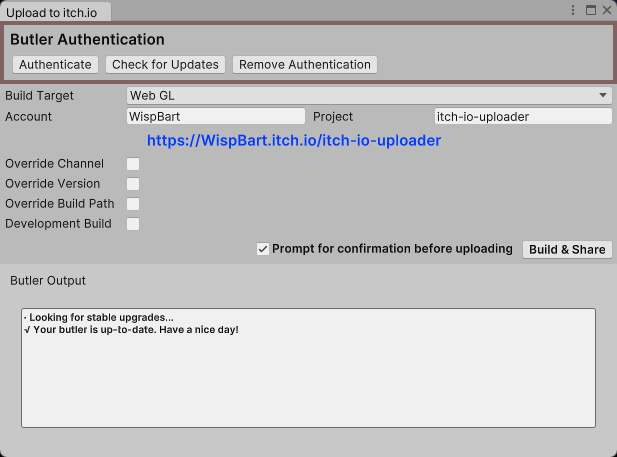

# Butler Window for Unity
A Unity Editor Window for uploading builds to Itch.io

This tool downloads & wraps [Butler](https://itch.io/docs/butler/) so you can build & upload your project to itch.io with a single button. It's ideal for rapidly sharing the latest iteration of your game, prototype or other without having to leave your Editor.

## Installation & Use

In the Unity Package Manager (window -> Package Manager), select the + and 'Add package from git URL' and type https://github.com/WispBart/ButlerWindow.git
Alternatively, download as a zip and extract to the Packages/ directory of your Unity Project.
After the package is successfully installed, you can find Butler Window under 'window -> Upload to itch.io'.

After letting the tool install Butler, Add the account and project name of an itch.io project you have access to. Click on the link to check if they are correct. Click Build & Share to build and upload your game.

## Requirements
Butler Window was tested with Unity 2019.4, and 2022.1. Butler Window can build to Windows, MacOS, Android and WebGL. 

## Supported Platforms
Butler Window / Upload to itch.io currently supports the UnityEditor on Windows and MacOS.
Currently supported build targets are: Windows standalone, Android and WebGL. 

## Security
Butler Window uses Butler for authentication, so no passwords are stored by the package.

## Known issues
* There is no way to see yet if you are already authenticated with Butler.
* The tool fails ungracefully if you do not have the required build module installed.
* The tool downloads and extracts Butler to %LocalAppData%\Butler, but does not attempt to find any existing installs in other locations.
